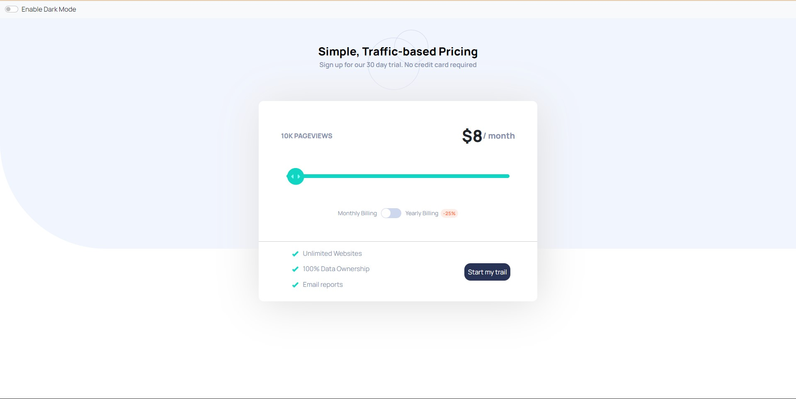

# Interactive pricing component

This is a solution to the [Interactive pricing component challenge on Frontend Mentor](https://www.frontendmentor.io/challenges/interactive-pricing-component-t0m8PIyY8). Frontend Mentor challenges help you improve your coding skills by building realistic projects. 

## Table of contents

- [Overview](#overview)
  - [The challenge](#the-challenge)
  - [Screenshot](#screenshot)
  - [Links](#links)
- [My process](#my-process)
  - [Built with](#built-with)
  - [What I learned](#what-i-learned)
  - [Continued development](#continued-development)
  - [Useful resources](#useful-resources)
- [Author](#author)
- [Acknowledgments](#acknowledgments)


## Overview

### The challenge

Users should be able to:

- View the optimal layout for the app depending on their device's screen size
- See hover states for all interactive elements on the page
- Use the slider and toggle to see prices for different page view numbers

###Video
 
(./React App.mp4)

### Screenshot



Above is the Screenshot of the Interactive Pricing component


### Links

- Solution URL: https://github.com/SRR-CODER/invsto_task
- Live Site URL: https://srr-coder.github.io/invsto_task/

## My process

### Built with

- Semantic HTML5 markup
- CSS custom properties
- Flexbox
- CSS Grid
- PC-first workflow
- [React](https://reactjs.org/) - JS library

### What I learned
Plz find below a part of my CSS code I used to handle various layouts:


```
@media screen and (max-width: 626px){
  body{
    background-size: inherit;
  }
  .top1{
    font-size: 150%;
  }
  .top2{
    font-size: 90%;
  }
  .bottom-outer{
    width: 80%;
    margin-left: 10%;
    padding-bottom: 10%;
  }
  .bottom-last-component{
    flex-direction: column;
  }
  .bottom-container{
    flex-direction: column;
  }
  label.name{
    font-size: 80%;
  }
  .rchild{
    margin-top: 1%;
  }
  .btn{
    margin-top: 2%;
    width: 160%;
    padding: 10%;
    /* margin-right: 40%; */
  }
  .btn-div{
    display: flex;
    justify-content: center;
    align-items: center;
  }
  .btn:hover{
    transform: scale(1.1);
  }
  .ul-container{
    width: 70%;
  }
}

@media screen and (min-width: 626px) and (max-width: 880px){
  .bottom-outer{
    width: 80%;
    margin-left: 10%;
  }
  /* .bottom-last-component{
    flex-direction: column;
  }
  .bottom-container{
    flex-direction: column;
  } */

  .bottom-last-component{
    justify-content: center;
  }
  label.name{
    font-size: 80%;
  }
  .rchild{
    margin-top: 1%;
  }
  .btn{
    width: 160%;
  }
  .btn:hover{
    transform: scale(1.1);
  }
  .ul-container{
    width: 50%;
  }
}

@media screen and (min-width: 880px) and (max-width: 1420px){
  .bottom-outer{
    width: 60%;
    margin-left: 20%;
  }
}
```


If you want more help with writing markdown, we'd recommend checking out [The Markdown Guide](https://www.markdownguide.org/) to learn more.

### Continued development

I want to work with APIs in future and Use Tailwind-CSS.

### Useful resources

- [BootStrap](https://getbootstrap.com/)
- [npm ReactJs](https://www.npmjs.com/) 

## Author

- Profile - [LinkedIn](www.linkedin.com/in/srriiitk)

## Acknowledgments

During the working of this project I learnt various concepts like dark mode which was somewhere deep in my mind to learn but
for some reason wasn't able to do it via this project that also I added in my knowledge Repository. Discovered some new sources of 
useful docs or components.
